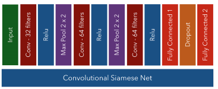

#Baseline Siamese Network
## Architecture
This identical network of the Siamese CNN consists of:

This identical network of the Siamese CNN consists of:
1. Conv layer with 32 filters, followed by ReLU and MaxPool 2x2
2. Conv layer with 64 filters, followed by ReLU and MaxPool 2x2
3. Conv layer with 64 filters, followed by ReLU
4. Fully connected layer with 400 hidden units
5. Dropout with probability = 0.5
6. Fully connected layer with 200 hidden units
7. L2 Regularization

## Training

After getting data in the appropriate paths, run train `trainBaseline.py` with the following flags and arguments:
  - `-c` or `--cuda` to run on GPU
  - `-e EPOCHS`
  - `--load_checkpoint PATH_TO_MODEL_CHECKPOINT`
  - `data_path` path to the .txt file containing training pairs
  - e.g.: `python trainBaseline.py ../Data_Preparation/IAM_Database_Datapairs/Windows_Pairs/train_30000.txt -c -e 20`
